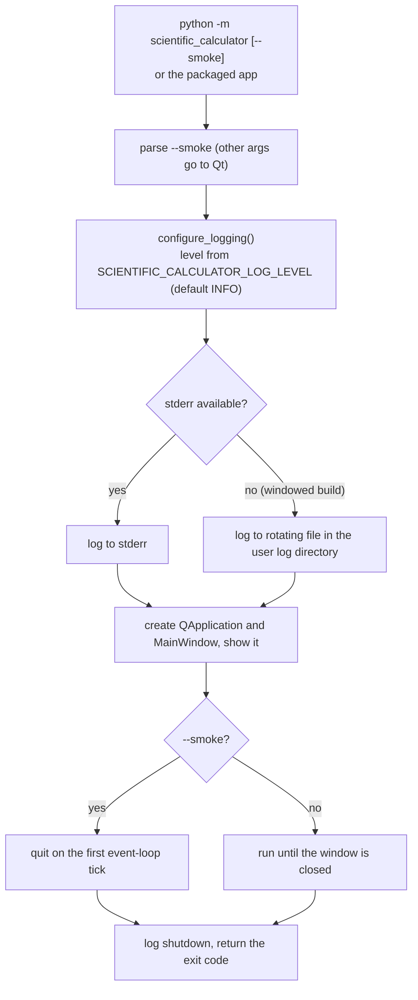
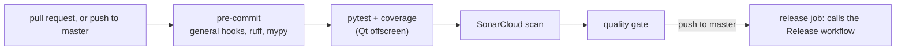
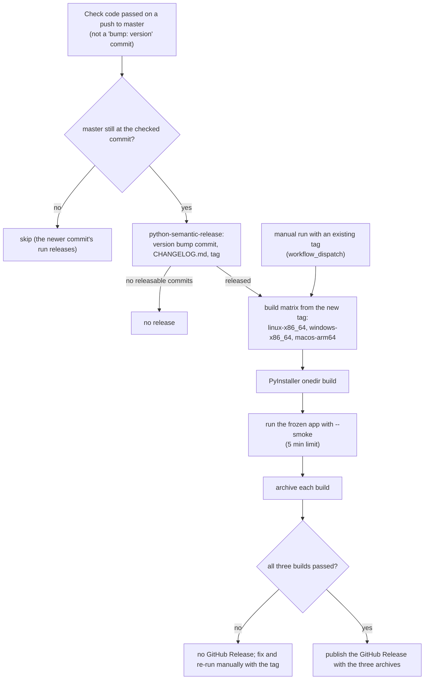

# Flows

## App start-up

```mermaid
flowchart TB
  start["python -m scientific_calculator [--smoke]<br/>or the packaged app"] --> args["parse --smoke (other args go to Qt)"]
  args --> log["configure_logging()<br/>level from SCIENTIFIC_CALCULATOR_LOG_LEVEL (default INFO)"]
  log --> handler{"stderr available?"}
  handler -->|yes| stream["log to stderr"]
  handler -->|"no (windowed build)"| file["log to rotating file in the user log directory"]
  stream --> qt["create QApplication and MainWindow, show it"]
  file --> qt
  qt --> smoke{"--smoke?"}
  smoke -->|yes| quit["quit on the first event-loop tick"]
  smoke -->|no| loop["run until the window is closed"]
  quit --> exit["log shutdown, return the exit code"]
  loop --> exit
```

## CI (Check code workflow)

```mermaid
flowchart LR
  trigger["pull request, or push to master"] --> pc["pre-commit<br/>general hooks, ruff, mypy"]
  pc --> test["pytest + coverage<br/>(Qt offscreen)"]
  test --> sonar["SonarCloud scan"]
  sonar --> gate["quality gate"]
  gate -->|"push to master"| release["release job: calls the Release workflow"]
```

## Release (Release workflow)

```mermaid
flowchart TB
  done["Check code passed on a push to master<br/>(not a 'bump: version' commit)"] --> tip{"master still at the checked commit?"}
  tip -->|no| skip2["skip (the newer commit's run releases)"]
  tip -->|yes| psr["python-semantic-release:<br/>version bump commit, CHANGELOG.md, tag"]
  psr -->|no releasable commits| skip3["no release"]
  psr -->|released| matrix["build matrix from the new tag:<br/>linux-x86_64, windows-x86_64, macos-arm64"]
  dispatch["manual run with an existing tag<br/>(workflow_dispatch)"] --> matrix
  matrix --> build["PyInstaller onedir build"]
  build --> smoke["run the frozen app with --smoke<br/>(5 min limit)"]
  smoke --> archive["archive each build"]
  archive --> all{"all three builds passed?"}
  all -->|no| norelease["no GitHub Release; fix and re-run manually with the tag"]
  all -->|yes| publish["publish the GitHub Release with the three archives"]
```
